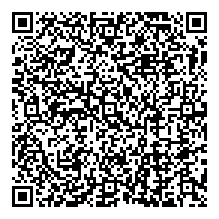

# secret-to-qrcode
Encrypt/decrypt short text to/from QR code.

You can encode small texts (for example passwords, 2FA secrets) in a password protected QR code image and print it. The program will ask for the encryption password and the secret text.

Later you can decode the image file or scan back the printed code using a web cam.

Text content size is limited by the QR code and the amount of error correction, but a few sentences are fine (up to about 3000 characters).

## Requirements
You need to install these system packages:
* gpg
* qrencode
* zbar

For example:
```
sudo dnf install gpg qrencode zbar
sudo apt-get install gnupg2 qrencode zbar
```

Try to decrypt this image. Password is **password**.



## Usage
Set the following aliases in your bashrc or zshrc.

```
alias qrenc='gpg -ca --cipher-algo AES256 | qrencode -l H -o secret.png'
alias qrdec='zbarimg -q --raw secret.png | gpg -qd'
alias qrcam='zbarcam --raw --nodisplay -Sdisable -Sqrcode.enable | gpg -qd'
```

The encrypted text will be saved in the secret.png image.

## Example
**Note**: Press ENTER then Ctrl-d to terminate secret input.
```
$ qrenc
Your secret is safe in this image.

$ qrdec
Your secret is safe in this image.

$ chmod 600 secret.png # just to make sure other users cannot read it

```