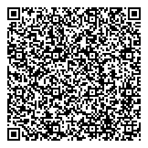

# secret-to-qrcode
Encrypt/decrypt short text to/from qr code

You can encrypt small texts (for example passwords, 2FA secrets) in qr code images and print them.
The content is further encrypted, it will ask for the encryption password.
Later you can scan back and decode the images.
Text content size is limited by the qr code, but a few sentences are fine.

## Requirements
You need to install these system packages:
* gpg
* qrencode
* zbar

And these python packages (if not already installed):
* hashlib
* binascii

For example, on Fedora 30:
```
sudo dnf install gpg qrencode zbar
```

Try to decode this image with the qrdecrypt script.
Password is **password**.



## Encyption
Execute qrencrypt to encrypt a text into a QR code using Gnu PGP's symmetric key encryption. Type the text and the password when prompted.

The encrypted text will be saved in the secret.png image.

## Decryption
Simply execute the qrdecrypt script.
It assumes the secret.png file is next to it.
It will prompt for the password.

## Example

```
$ ./qrencrypt
Secret: 
Password: 
Password again: 
Secret encoded and encrypted in secret.png.

$ ./qrdecrypt 
Password: 
Your secret is safe in this image!
```

## Further details
The password does not have to be too complex, as I use the PBKDF2 algorythm in Python to stretch the key size for the encryption. It makes brute-force attacks slower. Basically, this small addition complicated the code from one-liners to its current form. But I think it is worth the extra effort.

PBKDF2 alse needs a "salt" value. This is currently a fixed string, to be able to later decode the printed QR codes. Any better idea is welcome :)
